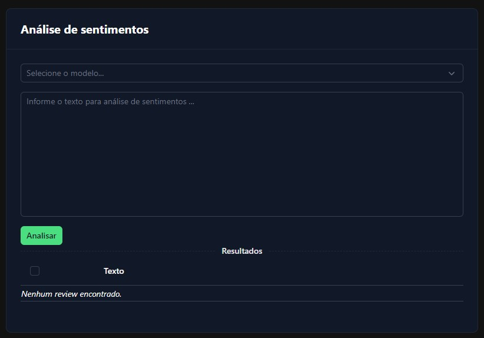

# Sentiment Analysis Frontend 



> Frontend para a API RESTful de análise de sentimentos em textos [Sentiment Analysis API](https://github.com/bpbastos/sentiment-analysis-ml-api) . Este frontend foi desenvolvido utilizando Nuxt 3, Vue 3, Tailwind CSS, NuxtUI e Zod.

> O desenvolvimento deste frontend faz parte do trabalho de conclusão do último módulo — Qualidade de Software, Segurança e Sistemas Inteligentes — da Pós-Graduação em Engenharia de Software da PUC-RIO. 

## 🛠️ TODO

- [ ] Refatorar app.vue para componentes

## 💻 Pré-requisitos

Antes de começar, verifique se o seu ambiente atende aos seguintes requisitos:

* `Docker`

> Instalação do docker: https://docs.docker.com/engine/install/

* `Node.js`

> Instalação do node: https://nodejs.org/en/learn/getting-started/how-to-install-nodejs

## 📦 Rodando com docker

Faça clone do projeto:
```
git clone https://github.com/bpbastos/sentiment-analysis-ml-front
```

Acesse o diretório do projeto com:
```
cd sentiment-analysis-ml-front
```

Crie um arquivo .env na raiz do diretório sentiment-analysis-ml-front com a seguinte variável:

> Se estiver usando Docker Desktop para Mac ou Windows, use host.docker.internal para acessar o IP do host. Caso contrário, utilize o IP da máquina host ou o IP do servidor onde a API está rodando.

```env
API_URL=http://host.docker.internal:5000/review
```

Para construir a imagem docker do projeto, execute:
```sh
docker compose build
```

Para rodar o projeto, execute:
```sh
docker compose up -d 
```

Abra o endereço http://localhost:3000 no seu navegador.

## 🚀 Rodando sem docker 

Clone ou faça download do projeto :
```
git clone https://github.com/bpbastos/sentiment-analysis-ml-front
```

Acesse o diretório do projeto com:
```
cd sentiment-analysis-ml-front
```

Após clonar o repositório, será necessário fazer a instalação das dependencias da aplicação.

```
npm install
```

No terminal execute o comando descrito abaixo para executar a API:

```
npm run dev -- -o
```
Abra o http://localhost:3000/ no navegador para acessar o frontend.